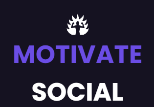

<!-- TITLE -->
<h1> MOTIVATE SOCIAL</h1> <br>
<div align="center">
  
  
<br>

Full Stack application developed as a challenge for an job apply. This is the Backend. Read the section About the Project for complete information. 
  

[![MIT License][license-shield]](https://github.com/MarioDoncel/backend-social-media-idip/blob/main/LICENSE)
[![LinkedIn][linkedin-shield]](https://www.linkedin.com/in/marioadoncel/)

<br />

<!-- TABLE OF CONTENTS -->
<details>
  <summary>Table of Contents</summary>
  <ol>
    <li>
      <a href="#about-the-project">About The Project</a>
      <ul>
        <li><a href="#built-with">Built With</a></li>
        <li><a href="#objective">Objective</a></li>
        <li><a href="#status">Status</a></li>
      </ul>
    </li>
    <li>
      <a href="#getting-started">Getting Started</a>
      <ul>
        <li><a href="#prerequisites">Prerequisites</a></li>
        <li><a href="#installation">Installation</a></li>
      </ul>
    </li>
    <li><a href="#usage">Usage</a></li>
    <li><a href="#license">License</a></li>
    <li><a href="#contact">Contact</a></li>
    <li><a href="#acknowledgments">Acknowledgments</a></li>
  </ol>
</details>
</div>

<!-- ABOUT THE PROJECT -->
## **About The Project**
API developed as a test for a Full Stack job apply. 

This is the Backend.

Link to Frontend : 
[https://github.com/MarioDoncel/frontend-social-media-idip](https://github.com/MarioDoncel/frontend-social-media-idip)

## **Test specifications:**
<hr>

### Creating a simple social networking platform with specific points to complete. The points are:

• On the social network it must be possible to register on a sign-up page and log in to it;

• User fields when registering must be:
-  Name;
-  Surname;
- Date of birth;
-  Telephone;
- E-mail;
- Password.

• Once logged into the platform the user should see all other users as well as their posts as described later;

• Each user's post must have a maximum of 500 characters;

• After the post has been made, the described text, the user's name and surname, in addition to the publication date, must be displayed;

• In each post users must be allowed to comment the related post with a maximum of 150 characters;

• After the comment has been made, the described text, the user's name and surname, in addition to the publication date, must be displayed;

• Users can follow each other as well as unfollow them;

• A user must change their basic registration information, as well as their password, and add a profile picture;

• A user may be able to delete their account and in doing so must have all their information removed;

### Mandatory criteria
1. Use typescript as a base; ✔️
2. Front-end in React or Vue; ✔️
3. Backend in Express, Adonis, Nest or Next; ✔️
4. Database of free choice; ✔️
5. Execution and functional documentation; ✔️
6. Automated tests;
7. Execution schedule; ✔️

### Free criteria
1. Carry out the layout creation phases, with the tool you want;
2. Provide public access to the result;

<hr>

## **My Project**
<hr>
The API was buil with Node(Express), Typescript, MongoDB Atlas and AWS S3. 

I created as much content as possible within the stipulated time(5 days).

**Created the models for**  
- User, 
- Post, 
- ValidRefreshTokens (to have more control on Users access). 

**Created the following routes :** 

- **Users**: 
  - **POST** - *' / '* - **Upload profile Image, Save Image in AWS S3, Create User and send an Email for Email verification.**
  - **POST** - *' /:id/follow '* - **Bearer authentication, Update Database to set followings and followers data about :id params User.**
  - **GET** - *' / '* - **Get all users**
  - **GET**- *' /findbyid/:userId '* - **Get user by :userId**
  - **GET** - *' /emailvalidation '* - **Verify user email**
  - **GET** - *' /emailvalidation/newtoken '* - **Basic Authentication, Send a new email to User with email verification link.**
  - **GET** - *' /login '* - **Basic Authentication, Made login and set tokens in secure cookies.**
  - **GET** - *' /isauth '* - **Bearer Authentication, Verify if tokens stored in cookies are valid.**
  - **PACTH** - *' / '* - **Bearer authentication, Upload profile Image, Save Image in AWS S3, Delete older profile image from AWS S3, Update User data**
  - **DELETE** - *' /:id/unfollow '* - **Bearer authentication, Update Database to delete following and follower data about :id params User.**
  - **DELETE** - *' /logout '* - **Logout the application, delete secure cookies and delete Valid Refresh Token from Database**
  - **DELETE** - *' / '* - **Bearer authentication, delete User and all Data about him**

<br>

  <br>
  <br>

- **Posts**: 
  - **POST** - *' / '* - **Bearer authentication, Upload post Image, Save Image in AWS S3, Create Post and send.**
  - **POST** - *' /:postId/comment '* - **Bearer authentication, Create comment on :postId param Post.**
  - **POST** - *' /:postId/like '* - **Bearer authentication, Create a like on :postId param Post.**
  - **GET** - *' / '* - **Get all posts**
  - **GET**- *' /:userId '* - **Get all posts by :userId**
  - **DELETE** - *' /:postid '* - **Bearer authentication, Delete a :postId param Post.**
  - **DELETE** - *' /:postid/comment '* - **Bearer authentication, Delete comment on :postId param Post.**
  - **DELETE** - *' /:postid/dislike '* - **Bearer authentication, Delete like on :postId param Post.**

<br>

#### - **Basic Authentication** - Authentication with req.body - EMAIL and  PASSWORD - fields
#### - **Bearer Authentication** - Authentication with tokens stored in secure cookies - ACCESS TOKEN (expires in 1 hour) and  REFRESH TOKEN (expires in 30 days) -  If AccessToken is expired check the Refresh Token to do the silent Login.
  
  <br>

**Created linter config**

**Created account to send verification emails at Sendgrid**

**Created error handlers**

**Created AWS S3 Bucket**

**Created Mongo Database in MongoDB Atlas**

**Created authentication strategy with JWT and refresh token**

**Folders structured by use cases**

**Created a cron-job to delete all expirated refresh tokens from database at 02:00AM everyday.**
  
 **Time of development**: 5 days

  - **Monday**: Backend - API, 

  - **Tuesday and Wednesday**: Frontend

  - **Thursday**: Integration Back+Front

  - **Friday**: Documentation and Deploy

<p align="right">(<a href="#top">back to top</a>)</p>


### Built With


* [Typescript](https://www.typescriptlang.org/)
* [NodeJs](https://nodejs.org/en/)
* [ExpressJs](https://expressjs.com/pt-br/)
* [JWT](https://jwt.io/)
* [MongoDB](https://www.mongodb.com/)
* [Mongoose](https://mongoosejs.com/)
* Node-cron
* ESLint
* JWT
* Multer
* Bcrypt
* Aws-sdk
* @sendgrid/mail


<p align="right">(<a href="#top">back to top</a>)</p>

### Objective

Project developed for a job apply.
<p align="right">(<a href="#top">back to top</a>)</p>

### Status

Finished.
<p align="right">(<a href="#top">back to top</a>)</p>

<hr>
<!-- GETTING STARTED -->
## Getting Started

### Prerequisites

<!-- This is an example of how to list things you need to use the software and how to install them. -->
* npm
  ```sh
  npm install npm@latest -g
  ```

### Installation

<!-- _Below is an example of how you can instruct your audience on installing and setting up your app. This template doesn't rely on any external dependencies or services._
 -->

1. Clone the repo
   ```sh
   git clone https://github.com/MarioDoncel/backend-social-media-idip
   ```
2. Install NPM packages
   ```sh
   npm install
   ```
3. Create a database at MongoDB Atlas and configure your environment variables  `.env`

   ```.env
    MONGO_CONNECTION=mongodb+srv://<username>:<password>@<cluster>.oczo8.mongodb.net/<database>?retryWrites=true&w=majority
    JWT_SECRET=yoursecret
    VERIFICATION_EMAIL_SECRET=yourSecret
    REFRESH_TOKEN_SECRET=yourSecret
    BCRYPT_SALT_ROUNDS=number
    SENDGRID_API_KEY=yourAPIKey
    SENDGRID_EMAIL_FROM=yourEmail
    CURRENT_DOMAIN=currentDomainOfTheApplication
    FRONT_DOMAIN=currentDomainOfTheFrontend
    AWS_REGION=bucketRegion
    AWS_ACCESS_KEY_ID=yourKey
    AWS_SECRET_ACCESS_KEY=yourSecretAccessKey
    ```
    
   
4. Run the application
    ```js
    npm run dev
    ```


<p align="right">(<a href="#top">back to top</a>)</p>


<!-- USAGE EXAMPLES -->
## Usage

### BaseURL - http://localhost:5000
<hr>

# **ROUTES**
     
## **USERS**

  ### **GET:**  
  
  * / -> Get all users
    - **Expected Response:** 
    ```json
      [
        {
          "_id":"ObjectId",
          "firstName":"string",
          "lastName":"string",
          "dateOfBirth": "string",
          "telephone": "string",
          "email": "string", 
          "emailVerified": false,
          "profileImage": "string",
          "followings": "ObjectId[]",
          "followers": "ObjectId[]",
          "createdAt": "Date",
          "updatedAt": "Date"
        }
      ]
     ```

     ```js
       return res.status(200).json(users) 
     ```
  * /findbyid/:userId -> Get user by Id
     
     - **Expected Response:** 
     ```json
       {
          "_id":"ObjectId",
          "firstName":"string",
          "lastName":"string",
          "dateOfBirth": "string",
          "telephone": "string",
          "email": "string", 
          "emailVerified": false,
          "profileImage": "string",
          "followings": "ObjectId[]",
          "followers": "ObjectId[]",
          "createdAt": "Date",
          "updatedAt": "Date"
        }
     ```

     ```js
       return res.status(200).json(user) 
     ```
  * /login -> User login
     
     - **Expected Response:** 
  
     ```json
       {
          "accessToken":"stringJWT",
          "refreshToken":{
            "_id":"ObjectId",
            "secret":"string",
            "accessId": "string",
            "expiresIn": "number",
          }
        }
     ```
     ```js
       return res.status(200).json(tokens) 
     ```
  * /isauth -> Tokens authentication
     
     - **Expected Response:** 
  
     ```json
       {
         "_id":"ObjectId",
          "firstName":"string",
          "lastName":"string",
          "dateOfBirth": "string",
          "telephone": "string",
          "email": "string", 
          "emailVerified": false,
          "profileImage": "string",
          "followings": "ObjectId[]",
          "followers": "ObjectId[]",
          "createdAt": "Date",
          "updatedAt": "Date"
        }
     ```
     ```js
       return res.status(200).json(loggedUser) 
     ```

  * /emailvalidation -> Set email verified TRUE
     
    - **Expected Response:** 
  
    ```js
      return res.status(200).redirect('/signin') 
    ```
  * /emailvalidation/newtoken -> Send new email with new token for email validation
     
    - **Expected Response:** 
  
    ```js
      return res.status(200).json('Email verification sent') 
    ```

     
  ### **POST:**
     
  * / -> Create user
  
    - **Expected Request Body:**
     ```json
       {
          "_id":"ObjectId",
          "firstName":"string",
          "lastName":"string",
          "dateOfBirth": "string",
          "telephone": "string",
          "email": "string", 
          "profileImage": "string"
      }
     ```

     - **Expected Response:** 
     ```json
       {
          "_id":"ObjectId",
          "firstName":"string",
          "lastName":"string",
          "dateOfBirth": "string",
          "telephone": "string",
          "email": "string", 
          "emailVerified": false,
          "profileImage": "string",
          "followings": "ObjectId[]",
          "followers": "ObjectId[]",
          "createdAt": "Date.now()",
          "updatedAt": "Date.now()"
        }
     ```

     ```js
       return res.status(201).json(user) 
     ```
  * /:id/follow -> Follow another User

     - **Expected Response:** 
     ```json
       {
          "_id":"ObjectId",
          "firstName":"string",
          "lastName":"string",
          "dateOfBirth": "string",
          "telephone": "string",
          "email": "string", 
          "emailVerified": false,
          "profileImage": "string",
          "followings": "ObjectId[]",
          "followers": "ObjectId[]",
          "createdAt": "Date",
          "updatedAt": "Date"
        }
     ```

     ```js
       return res.status(201).json(updatedUser) 
     ```
     
  ### **PATCH:**
     
  * / -> Update user 
        
    - **Expected Request Body:**
     ```json
       {
          "fieldsToUpdate":"value",
         ...
        }
     ```

      - **Expected Response: 
     ```json
       {
         "_id":"ObjectId",
          "firstName":"string",
          "lastName":"string",
          "dateOfBirth": "string",
          "telephone": "string",
          "email": "string", 
          "emailVerified": false,
          "profileImage": "string",
          "followings": "ObjectId[]",
          "followers": "ObjectId[]",
          "createdAt": "Date",
          "updatedAt": "Date.now()"
        }
     ```
     ```js
       return res.status(200).json(updatedUser) 
     ```
  ### **DELETE:**
     
  * /logout -> Logout user 
        
      - **Expected Response:** 
    
     ```js
       return res.status(200).json('Logout success');
     ```
  * /:id/unfollow -> Unfollow user 
        
      - **Expected Response:** 

      ```json
       {
         "_id":"ObjectId",
          "firstName":"string",
          "lastName":"string",
          "dateOfBirth": "string",
          "telephone": "string",
          "email": "string", 
          "emailVerified": false,
          "profileImage": "string",
          "followings": "ObjectId[]",
          "followers": "ObjectId[]",
          "createdAt": "Date",
          "updatedAt": "Date.now()"
        }
     ```
    
     ```js
       return res.status(200).json('Logout success');
     ```
## **POSTS**

  ### **GET:**  
  
  * / -> Get all posts
    - **Expected Response:** 
    ```json
      [
        {
          "_id":"ObjectId",
          "userId":"string",
          "text":"string",
          "image": "string",
          "comments": {"text": "string", "userId": "ObjectId"}[],
          "likes": "ObjectId[]", 
          "createdAt": "Date",
          "updatedAt": "Date"
        }
      ]
     ```

     ```js
       return res.status(200).json(posts) 
     ```
  * /:userId -> Get all posts by user id
    - **Expected Response:** 
    ```json
      [
        {
          "_id":"ObjectId",
          "userId":"string",
          "text":"string",
          "image": "string",
          "comments": {"text": "string", "userId": "ObjectId"}[],
          "likes": "ObjectId[]", 
          "createdAt": "Date",
          "updatedAt": "Date"
        }
      ]
     ```

     ```js
       return res.status(200).json(posts) 
     ```
     
  ### **POST:**

  * / -> Create a post
    - **Expected Response:** 
    ```json
      {
        "_id":"ObjectId",
        "userId":"string",
        "text":"string",
        "image": "string",
        "comments": {"text": "string", "userId": "ObjectId"}[],
        "likes": "ObjectId[]", 
        "createdAt": "Date",
        "updatedAt": "Date"
      }
     ```

     ```js
       return res.status(201).json(post) 
     ```
  * /:postId/comment -> Create a comment in :postId param Post
  
    - **Expected Response:** 
    ```json
      [
        {
          "_id":"ObjectId",
          "text": "string",
          "userId": "ObjectId",
          "createdAt":"Date"
        }
      ]
     ```

     ```js
       return res.status(201).json(post.comments) 
     ```
  * /:postId/like -> Give like to in :postId param Post
    - **Expected Response:** 
    ```json
      [
        "ObejctId"
      ]
     ```

     ```js
       return res.status(201).json(post.likes) 
     ```
  ### **DELETE:**

  * /:postId -> Delete a Post
    - **Expected Response:** 
     ```js
       return res.status(200).json('Post deleted');
     ```
  * /:postId/comment -> Delete a comment from :postId param Post

    - **Expected Request Body:**
     ```json
       {
          "commentId":"string",
         
        }
     ```
    - **Expected Response:** 
    ```json
      [
        {
          "_id":"ObjectId",
          "text": "string",
          "userId": "ObjectId",
          "createdAt":"Date"
        }
      ]
     ```

     ```js
       return res.status(200).json(post.comments) 
     ```
  * /:postId/dislike -> Remove a like from :postId param Post
    - **Expected Response:** 
    ```json
      [
        "ObejctId"
      ]
     ```

     ```js
       return res.status(200).json(post.likes) 
     ```
     
  
  

<p align="right">(<a href="#top">back to top</a>)</p>


<!-- LICENSE -->
## License

Distributed under the MIT License. See `LICENSE.txt` for more information.

<p align="right">(<a href="#top">back to top</a>)</p>


<!-- CONTACT -->
## Contact

Mario Andres Doncel Neto  

Email - 88mario.doncel@gmail.com <br>
Whatsapp - +55 19 99612 9909

Project Link: [https://github.com/MarioDoncel/backend-social-media-idip](https://github.com/MarioDoncel/backend-social-media-idip)

<p align="right">(<a href="#top">back to top</a>)</p>


<!-- ACKNOWLEDGMENTS -->
## Acknowledgments

* IDIP Tecnologia

<p align="right">(<a href="#top">back to top</a>)</p>


<!-- MARKDOWN LINKS & IMAGES -->
<!-- https://www.markdownguide.org/basic-syntax/#reference-style-links -->
[contributors-shield]: https://img.shields.io/github/contributors/othneildrew/Best-README-Template.svg?style=for-the-badge
[contributors-url]: https://github.com/othneildrew/Best-README-Template/graphs/contributors
[forks-shield]: https://img.shields.io/github/forks/othneildrew/Best-README-Template.svg?style=for-the-badge
[forks-url]: https://github.com/othneildrew/Best-README-Template/network/members
[stars-shield]: https://img.shields.io/github/stars/othneildrew/Best-README-Template.svg?style=for-the-badge
[stars-url]: https://github.com/othneildrew/Best-README-Template/stargazers
[issues-shield]: https://img.shields.io/github/issues/othneildrew/Best-README-Template.svg?style=for-the-badge
[issues-url]: https://github.com/othneildrew/Best-README-Template/issues
[license-shield]: https://img.shields.io/github/license/othneildrew/Best-README-Template.svg?style=for-the-badge
[license-url]: https://github.com/othneildrew/Best-README-Template/blob/master/LICENSE.txt
[linkedin-shield]: https://img.shields.io/badge/-LinkedIn-black.svg?style=for-the-badge&logo=linkedin&colorB=555
[linkedin-url]: https://linkedin.com/in/othneildrew
[product-screenshot]: images/screenshot.png
